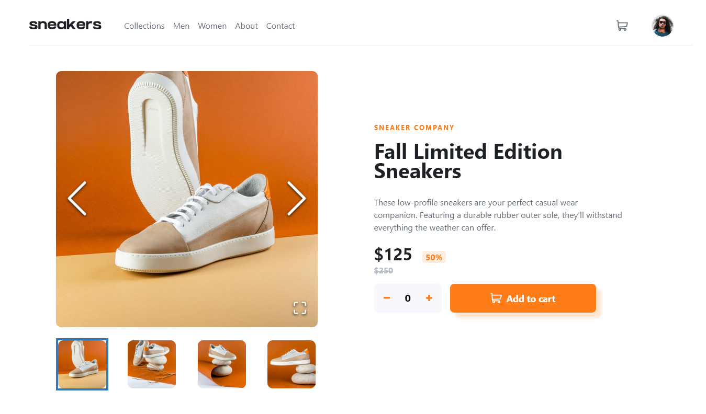

# Frontend Mentor - Ping coming soon page solution

This is a solution to the [Ping coming soon page challenge on Frontend Mentor](https://www.frontendmentor.io/challenges/ping-single-column-coming-soon-page-5cadd051fec04111f7b848da). Frontend Mentor challenges help you improve your coding skills by building realistic projects. 

## Table of contents

- [Overview](#overview)
  - [The challenge](#the-challenge)
  - [Screenshot](#screenshot)
  - [Links](#links)
- [My process](#my-process)
  - [Built with](#built-with)
  - [What I learned](#what-i-learned)
  - [Useful resources](#useful-resources)
- [Author](#author)

**Note: Delete this note and update the table of contents based on what sections you keep.**

## Overview
  This was my second project for a frontendmentor challenge using react, an increadibly fun experience i did this challenge first in vanilla JS and i wasnt quite happy with the
  result was functional but almost all the information of the page was hardcoded, the react version was way more easy to deal with, with the use of hooks handle the information 
  and display it, this project help me out to undestand the problems that react solves and the way it solves them 

### The challenge

Users should be able to:

- View the optimal layout for the site depending on their device's screen size
- See hover states for all interactive elements on the page
- Submit their email address using an `input` field
- Receive an error message when the `form` is submitted if:
	- The `input` field is empty. The message for this error should say *"Whoops! It looks like you forgot to add your email"*
	- The email address is not formatted correctly (i.e. a correct email address should have this structure: `name@host.tld`). The message for this error should say *"Please provide a valid email address"*

### Screenshot

Add a screenshot of your solution. The easiest way to do this is to use Firefox to view your project, right-click the page and select "Take a Screenshot". You can choose either a full-height screenshot or a cropped one based on how long the page is. If it's very long, it might be best to crop it.

Alternatively, you can use a tool like [FireShot](https://getfireshot.com/) to take the screenshot. FireShot has a free option, so you don't need to purchase it. 

Then crop/optimize/edit your image however you like, add it to your project, and update the file path in the image above.

**Note: Delete this note and the paragraphs above when you add your screenshot. If you prefer not to add a screenshot, feel free to remove this entire section.**

### Links

- Solution URL: [solution URL ](https://github.com/Silkiercomet/react-ecommerce-product-component)
- Live Site URL: [Add live site URL here](https://silkiercomet.github.io/react-ecommerce-product-component/)

## My process

first i develop the UI with a mobile first approach, first created the navbar and add the needed it affects like the container dropdown and the mobile modal and slide-menu,
once i was done with that i did the showcase component for the product, i created a component that imports an object just like what well get if we make a fetch request to a
database, and print it in the screen, i also used a library that added the slideshow gallery to my project this was prove to save some time but at the cost of some unexpected
behavior from the gallery, the last thing that did was to work in the cart interaction, i was tempted to use a context hook and that would have proven useful to pass less
arguments between the components but they werent that many and i can always improve the code

### Built with

- Semantic HTML5 markup
- CSS custom modules
- Flexbox
- CSS Grid
- Mobile-first workflow
- [React](https://reactjs.org/) - JS library
- [gallerys://www.npmjs.com/package/react-image-gallery/) - react image gallery

### What I learned

i approched this project with a mobile first design in mind and came out pretty well, normally i like to do the desktop version first because for mobile its easier to just
use media queries to adapt it, but is just as easy to do it all the way around and the mobile version (that normally i had to debug) was less buggy

## Author
- Frontend Mentor - [@Comet466](https://www.frontendmentor.io/profile/Comet466)

